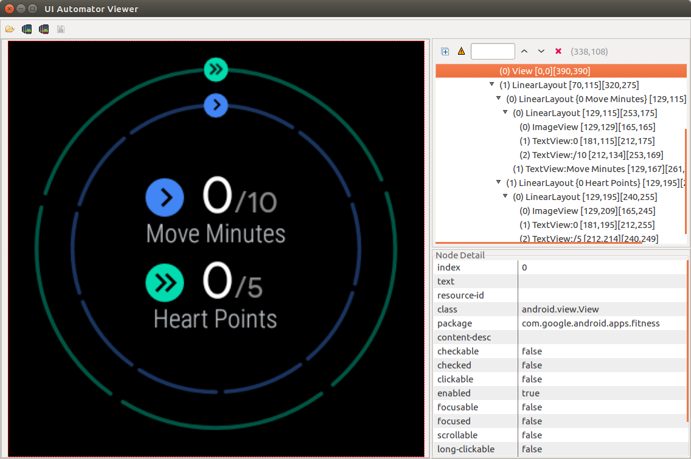

### Comments

Look for the following comment tags:
 
 * `# TODO`
 * `# FIXME`
 * `# NOTE: /dcsl/`
 
### Resources

* uiautomator (command line)
Getting an xml representation of widgets in the device.

```
adb exec-out uiautomator dump /dev/tty
```
 * uiautomator viewer
 A bit more sophisticated that the uiautomator, the viewer present the XML hierarchy using GUI.
 Check more in [Android Developers > Docs > Guide > UI Automator](https://developer.android.com/training/testing/ui-automator#ui-automator-viewer)
 
```
[Android SDK]\tools\bin\uiautomatorviewer
```
<center>

</center>

### References

 * [StackOverflow: Using ADB to access a particular UI control in the screen](https://stackoverflow.com/questions/18924968/using-adb-to-access-a-particular-ui-control-on-the-screen)
